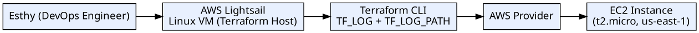

# Terraform Debugging with TF_LOG (AWS Lightsail)

This project demonstrates how to enable and analyze Terraform debug logs using the `TF_LOG` and `TF_LOG_PATH` environment variables on a Linux system running on AWS Lightsail.

## Ì¥ß Tools & Technologies
- Terraform
- AWS EC2
- AWS Lightsail (Linux)
- AWS CLI
- Git
- VS Code

## ‚úÖ What This Project Covers
- Enabling Terraform Debugging with `TF_LOG`
- Writing logs to a custom file using `TF_LOG_PATH`
- Observing different log levels: DEBUG and WARN
- Debugging real-world IAM permission issues
- Provisioning and destroying EC2 infrastructure with Terraform

## ̪† Terraform Configuration
The `main.tf` file provisions a simple EC2 instance:
```md

```hcl
resource "aws_instance" "ec2demo" {
  ami           = "ami-04d29b6f966df1537"
  instance_type = "t2.micro"
}

---

```md
## Ì≥ä Architectur Diagram




Ì≥Ç Debug Log Location
/home/ec2-user/debug.log
Ì∑π Cleanup

All infrastructure was destroyed using:

terraform destroy --auto-approve
̱©ÌøΩ‚ÄçÌ≤ª Author

EsthyTech ‚Äî Cloud & DevOps Engineer Ì∫Ä
